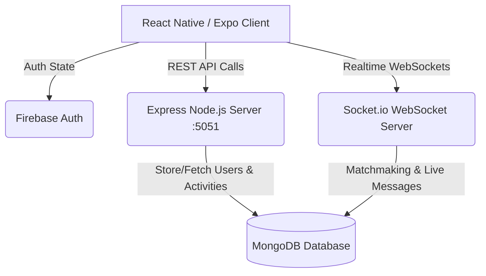

# ClickMate

ClickMate is a real-time social networking and matching application built with React Native and Expo. It connects users based on their current mood, selected activities, or shared interests using a WebSocket matchmaking system.

Whether looking for a hiking partner, someone to watch a movie with, or a person to chat with, ClickMate coordinates the matching process in real time.

---

## Screenshots & UI Preview

Below is a summary of the user flow:
- **Login / Signup**: User registration and login powered by Firebase Authentication.
- **Home**: Natural language mood matching and quick-selection tags.
- **Explore**: Activity-specific matching featuring dynamically fetched hikes and movies.
- **Chat**: Real-time messaging with unread status indicators and chat history options.

---

## Core Features

*   **Secure Authentication:** User registration and session persistence using Firebase Authentication and a MongoDB backend.
*   **Real-Time Matching:** User connections based on custom search queries and moods, facilitated by a persistent WebSocket matchmaking system.
*   **Chat System:** Instant messaging powered by Socket.io, featuring unread message badges, message history management, and clear-chat actions.
*   **Activity Exploration:** Curated lists of activities, such as hikes and movies, allowing users to find partners interested in the same event.
*   **Profile Management:** Customizable user profiles with bio updates, interest tag selection, and account deletion functionality.
*   **Styling:** A clean and responsive user interface designed with Tailwind CSS and NativeWind.
*   **Multi-Platform Support:** A single codebase optimized for iOS, Android, and Web deployment.

---

## Architecture & Data Flow

ClickMate relies on a hybrid server setup to coordinate matching and real-time messaging. The system flow is structured as follows:



---

## Project Structure

Below is an overview of the key folders and files in the repository:

```
clickmate/
├── App.jsx                # App entry point (initializes Recoil and Context Providers)
├── _layout.jsx            # Navigation structure (Tab and Stack Navigation)
├── AuthContext.jsx        # Manages Firebase auth state and updates Recoil state
├── FirebaseConfig.js      # Initializes the Firebase client application instance
├── FirebaseSecret.js      # Firebase credential configuration
├── constant.js            # Configuration constants (stores the server IP address)
├── app/
│   ├── components/        # Reusable UI components
│   │   ├── CarouselComp.js
│   │   ├── CreateAvatar.js
│   │   └── ToggleSwitch.js
│   ├── state/             # Recoil state atoms for global state management
│   │   └── atoms/
│   └── screens/           # Main application screens
│       ├── Login.jsx      # Login interface
│       ├── SignUp.jsx     # Registration form and database insertion
│       ├── Home.jsx       # Matchmaking trigger and mood entry
│       ├── Result.jsx     # Match results and messaging redirect
│       ├── People.jsx     # Friend list and unread count overview
│       ├── Profile.jsx    # User settings and interest selector
│       ├── VisitorProfile.jsx  # Read-only profile view of matched users
│       ├── Explore.jsx    # General activity list screen
│       ├── ExploreSearch.jsx   # Specific activity search screen
│       └── ChatScreen/    # Chat module components
│           ├── ChatScreen.jsx
│           ├── Header.js
│           ├── MessageInputBox.js
│           └── MessagesList.js
├── assets/                # Media files, fonts, and application icons
├── babel.config.js        # Babel configuration file
├── tailwind.config.js     # Tailwind CSS styles and custom theme configurations
└── metro.config.js        # Metro bundler configuration
```

---

## Getting Started

Follow these steps to run ClickMate locally in your development environment.

### Prerequisites

Ensure you have the following installed on your machine:
*   Node.js (v18.x or v20.x recommended)
*   npm or yarn
*   Expo Go application installed on a physical iOS/Android device to test without local compilation

### 1. Clone & Install Dependencies

```bash
# Clone the repository
git clone https://github.com/yourusername/clickmate.git
cd clickmate

# Install application dependencies
npm install
```

### 2. Configuration Setup

#### A. Firebase Configuration
Update `FirebaseSecret.js` with your Firebase project credentials. The file must export a `firebaseSecret` configuration object:

```javascript
// FirebaseSecret.js
export const firebaseSecret = {
  apiKey: "YOUR_API_KEY",
  authDomain: "YOUR_PROJECT_ID.firebaseapp.com",
  projectId: "YOUR_PROJECT_ID",
  storageBucket: "YOUR_PROJECT_ID.appspot.com",
  messagingSenderId: "YOUR_MESSAGING_SENDER_ID",
  appId: "YOUR_APP_ID"
};
```

#### B. Update Backend Server IP
Because mobile simulators and physical devices cannot resolve `localhost` in the same way, you must configure the local IP address of your host machine. This is handled dynamically via environment variables in the `.env` file at the root of the project:

```env
# .env
EXPO_PUBLIC_IP=192.168.X.X
```

In `constant.js`, this variable is read automatically:

```javascript
// constant.js
export const IP = process.env.EXPO_PUBLIC_IP;
```

> [!TIP]
> On macOS, retrieve your local IP by running `ipconfig getifaddr en0` in the terminal. On Windows, execute `ipconfig` in the Command Prompt.


---

## Backend Server Integration

The mobile application connects to an external Node.js backend server, which runs by default on port `5051`.

### REST API Endpoints

| Method | Endpoint | Description |
| :--- | :--- | :--- |
| **GET** | `/user/:email` | Fetches a user profile from MongoDB |
| **POST** | `/register` | Inserts a new user record into MongoDB |
| **PATCH** | `/user/:id` | Updates user details, biography, and interest tag lists |
| **DELETE**| `/deleteUser/:userId/:uid` | Deletes a user profile from MongoDB and Firebase Auth |
| **GET** | `/interests` | Retrieves the global collection of interest tags |
| **POST** | `/create-chat` | Creates a new chat database record between two users |
| **GET** | `/unread-messages/:userId` | Retrieves count of unread messages |
| **GET** | `/explore` | Retrieves available categories (such as hikes or movies) |

### WebSocket (Socket.io) Event Handlers

The application exchanges real-time data with the backend using the following WebSocket events:

#### Outbound Client Events (Emitted by Client):
*   `submit_keyword` (`{ userId, query }`): Enters a user into matchmaking for a specific keyword.
*   `cancel_search` (`{ userId }`): Cancels matchmaking search.
*   `joinChat` (`{ chatId }`): Joins a real-time room for direct messages.
*   `leaveChat` (`{ chatId }`): Leaves the active chat room.
*   `sendMessage` (`{ chatId, message: { sender, content } }`): Sends a message payload.
*   `clearMessages` (`{ chatId }`): Clears the message history of a chat room.
*   `markAsRead` (`{ chatId, userId }`): Clears unread messages status.

#### Inbound Server Events (Received by Client):
*   `search_update`: Receives notifications about matchmaking search matches.
*   `receiveMessage`: Receives incoming messages in the joined chat room.
*   `messagesCleared`: Notifies the app that the message history has been wiped.
*   `updateUnreadCounts`: Notifies the client to pull updated unread indicators.

---

## Run the Development Server

Start the Metro bundler locally:

```bash
# Start the Metro bundler
npm start
```

*   Press **`a`** to open the Android emulator.
*   Press **`i`** to open the iOS simulator.
*   Press **`w`** to launch the web preview in your browser.
*   Alternatively, scan the terminal QR code with your camera (iOS) or the Expo Go application (Android) to test on a physical device connected to the same network.

---

## Testing

To run unit and integration tests setup within the project:

```bash
npm run test
```

---

## License

This project is licensed under the Apache License 2.0.

## Contact

Created by Subhom Kundu. For questions, bug reports, or feature requests, contact [subhomkundu@gmail.com](mailto:subhomkundu@gmail.com) or submit a pull request to the repository.
